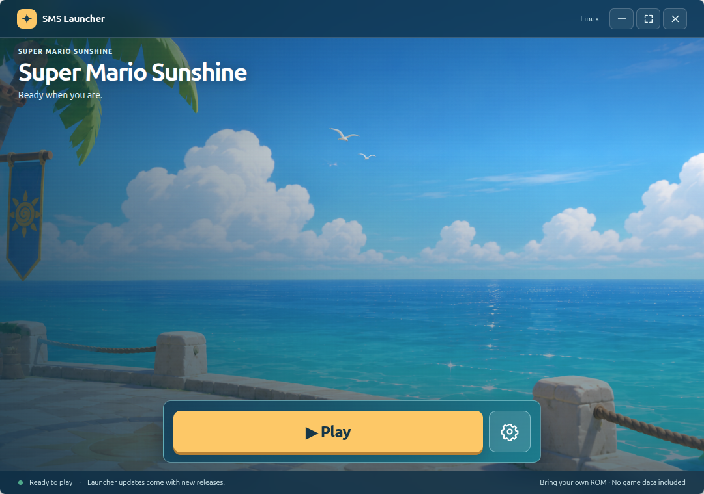

# SMS Launcher

Electron setup and play launcher for [sms-pc-port](https://github.com/chasem-dev/sms-pc-port). The launcher is a **sibling** of the port checkout (`sms-launcher/` next to `sms-port/`) during development. It does not include game data.

## Start

1. Install Node.js 22 or newer and npm. From `sms-launcher/`, run `npm ci` and `npm start`.
2. Download the setup files to the suggested location, or choose a different install location first. On Linux and Windows, Step 1 also downloads the required build tool archive, verifies its SHA-256 checksum, and unpacks it into the launcher's private data folder. Development runs detect a neighboring `sms-port/` automatically. An existing setup folder can be selected later in **Settings → Game files**.
3. Choose a file copied from your own **North American Super Mario Sunshine GMSE01 Rev 0** disc (`.iso`, `.gcm`, or Dolphin `.ciso`). The launcher reads it in place and saves only its path in local preferences.
4. Select **Begin setup**. The launcher installs any selected HD textures and builds the game. When setup finishes, Home shows **Play**. Use **Settings → Manage game → Rebuild game** when you want a fresh build.

Home uses the supplied seaside artwork as its background. First run has three screens: download setup files, choose your disc image, and begin setup. The step indicator shows where you are; the task progress bar shows downloads and building. Once the game is ready, Home simplifies to Play and the Settings cog. Open **Settings → Game files** to change the setup folder or disc file later. **Manage game** groups rebuild, updates, space cleanup, backups, and the activity log. Use Back to return to Settings. The frameless window can be dragged by its top bar; its top-right buttons minimize, toggle full screen, and close the window.

Linux and Windows use prepared build tool archives published as separate GitHub Release assets. The launcher downloads the matching archive automatically once; there is no manual MSYS2 installation and no package manager runs on the user's computer. The archive's checksum is pinned in the launcher, and the tools stay in its private data folder, outside the port build and save folders. Launcher updates reuse the same toolset. Failed downloads or unpacking preserve the previous tools. Linux includes Git, CMake, Python, GCC, SDL2, EGL, Make, patch, binutils, and 7-Zip in a relocatable conda-forge environment. Windows includes a prepared MSYS2 tree for the current MINGW32 game build on an x64 computer. Source archives and package notices accompany the tools. macOS downloads a separate native tool archive for Intel or Apple Silicon, including LLVM, CMake, Python, Git, Make, patch, and 7-Zip. Only Apple's Command Line Tools and Rosetta (on Apple Silicon) require a one-time system install; Step 1 checks these before proceeding. Homebrew is not required. See [build tool publishing](docs/build-tools.md) for the separate toolset workflow.

Linux supports 64 and 32 bit game builds; macOS supports x86_64 (Rosetta 2 on Apple Silicon); Windows currently builds a 32 bit game on a 64 bit computer. The launcher offers only supported choices. Linux 32 bit builds still need a compatible multilib runtime and libraries; the private Linux toolset currently covers the default 64 bit game build. The first build may take a while and, for the standard game, also creates a private standalone build from your image.

Home shows the current task, elapsed time, and a progress bar. It uses the actual percentage when the port or Git reports one; downloads and unpacking show their current phase while the source tool does not report a percentage.

## HD textures

HD textures are optional and off for new users. Turn them on in **Settings → Visuals**. The launcher detects an existing pack in the port's `mods/textures` folder; otherwise choose **Download HD textures** there. If enabled during first run, **Begin setup** downloads them before building the game. The installer downloads the authors' pack (about 1 GB, about 3 GB installed) and checks its checksum. Python 3 and 7-Zip come from the prepared tools when system copies are missing. The launcher points the running game at that folder when HD textures are on. Installations and changes take effect on the next game start. The texture pack stays in the port checkout, separate from launcher updates and builds.

## Eclipse

Enable **Super Mario Eclipse**, then choose **Install Eclipse mod** or select **Begin setup** if it appears on Home. The installer downloads the official patch and applies it to your own original image. It needs Python 3 and 7-Zip as described in the port's `mods/README.md`. Eclipse uses a separate `build/<os>-<arch>-eclipse/` tree. It builds against the port's `eclipse` branch and runs the installed patched disc without bundling it. Toggle Eclipse off to return to the original build.

The Eclipse patcher needs an unmodified 1:1 GMSE01 image; a compressed CISO does not pass its checksum. Eclipse builds have been verified in the port on Linux. The launcher offers the same build path on macOS and Windows, marked experimental until those port builds are verified there.

## Updates and cleanup

The launcher checks the port's tracked Git branch on startup and every 30 minutes, fetches its upstream, and applies only fast forward updates. It never resets local edits; if a merge cannot be applied, the activity log explains why. **Check for updates** is also available. Rebuild after a source update. **See removable files** shows what the port's `clean.sh` would remove; **Free up space** asks for confirmation and then runs it. The port script preserves disc images and saves.

Memory card saves stay in the port's usual user data folder, independent of launcher installs and build folders. The launcher honors `SMS_SAVE_DIR` or `save_dir` in the port's `settings.txt`, and shows the resolved save path in the app. It makes verified, dated copies before each play session, after play exits, and before a port update or cleanup. Cleanup refuses to run if a custom save folder is inside a removable build folder. When changing compilers, it keeps the previous build and preserves custom saves in their original location, with a verified backup and rollback if restoring fails. Backups live in `~/SMS Launcher Backups` (the Windows user profile folder on Windows), outside both the launcher installation and port checkout. **Back up now**, **Open backups**, and **Restore selected backup** are in the app. Restore verifies the selected backup and saves the current memory card first. No ROM or patched disc is included in these backups. Keep an additional copy of the backup folder on another drive or cloud service to protect against disk failure.

Packaged launcher builds support self updates through `electron-updater`. A `package.json` version bump pushed to `main` makes `.github/workflows/release.yml` create its `vX.Y.Z` tag, build an x64 Linux AppImage, universal macOS DMG/ZIP for Intel and Apple Silicon, and x64 Windows installer, and publish a release after every build succeeds. The game port itself can still build 32 bit on supported 64 bit systems. Release packages embed their GitHub update feed, check on startup and every 30 minutes, download updates, and install them on quit. Unsigned macOS builds can be downloaded, but macOS automatic updates need the `MAC_CSC_LINK` and `MAC_CSC_KEY_PASSWORD` signing secrets. `SMS_LAUNCHER_UPDATE_URL` can override the embedded feed with an HTTPS generic update feed. Local packages made without a release feed still update the port source, but cannot update the launcher itself.

For a later release, run `npm version patch --no-git-tag-version`, commit the updated `package.json` and `package-lock.json`, and push to `main`. The workflow creates the tag after the push. Version bumps can also use `minor` or `major`.

Build platform packages with `npm run dist`. The installer includes only the launcher code, never the port checkout, ROMs, mods, standalone game builds, or saves. Linux, Windows, and native Intel/Apple Silicon Mac build tool archives are separate assets attached to each launcher release and downloaded during setup. `npm test` runs the launcher command, disc selection, tool replacement, Mac prerequisite, and save backup tests. The separate **Smoke test build tools** workflow runs on pushes to `main`, pull requests, a weekly schedule, and manual requests. It downloads the exact published archives, verifies their pinned checksums, and compiles the port without any disc image, then checks that CMake used the expected compiler. Mac tests use only the private tools and Apple's installed compiler and SDK, including paths containing spaces. It does not package or publish the launcher.
